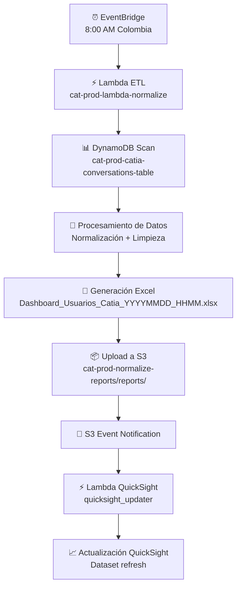
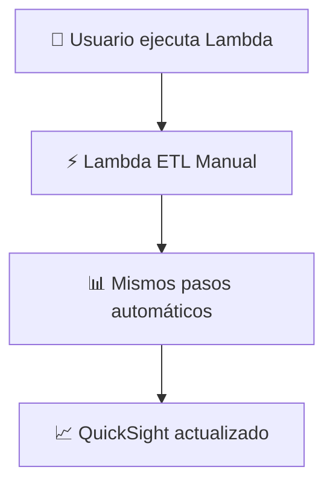

# 📊 RECAPITULACIÓN COMPLETA DEL PROCESO DE AUTOMATIZACIÓN
## Sistema ETL con EventBridge + QuickSight para Conversaciones de Catia

### 🎯 **RESUMEN EJECUTIVO**

Hemos implementado un sistema de automatización completo que procesa diariamente los datos de conversaciones de Catia, genera reportes en Excel y actualiza automáticamente los dashboards de QuickSight.

---

## 🏗️ **ARQUITECTURA IMPLEMENTADA**

### 📦 **COMPONENTES AWS PRINCIPALES**

#### 1. **S3 BUCKET**
- **Nombre**: `cat-prod-normalize-reports`
- **Propósito**: Almacenar archivos Excel generados
- **Configuración**: 
  - Versionado habilitado
  - Acceso público bloqueado
  - Política de retención: RETAIN

#### 2. **LAMBDA FUNCTION - ETL PRINCIPAL**
- **Nombre**: `cat-prod-lambda-normalize`
- **Runtime**: Python 3.9
- **Memoria**: 1024 MB (1 GB)
- **Timeout**: 15 minutos
- **Propósito**: Procesa datos de DynamoDB y genera Excel
- **Archivo**: `lambda/lambda_function.py` (665 líneas)

**Variables de entorno:**
```
S3_BUCKET_NAME: cat-prod-normalize-reports
DYNAMODB_TABLE_NAME: cat-prod-catia-conversations-table
```

#### 3. **LAMBDA FUNCTION - QUICKSIGHT UPDATER**
- **Nombre**: Función para actualizar QuickSight
- **Runtime**: Python 3.9
- **Propósito**: Actualizar dataset cuando se suben archivos Excel
- **Archivo**: `lambda-quicksight/quicksight_updater.py` (226 líneas)

**Variables de entorno (configuradas):**
```
QUICKSIGHT_DATASET_ID: reporte_conversaciones_catia_prod_20250815
QUICKSIGHT_DATASET_NAME: reporte_conversaciones_catia_prod_20250815(Datos2)
AWS_ACCOUNT_ID: [Dinámico]
S3_BUCKET_NAME: cat-prod-normalize-reports
```

#### 4. **EVENTBRIDGE RULE**
- **Nombre**: `cat-prod-etl-daily-schedule`
- **Expresión cron**: `cron(0 13 * * ? *)`
- **Horario**: 8:00 AM Colombia (1:00 PM UTC)
- **Frecuencia**: Diaria
- **Target**: Lambda ETL principal

#### 5. **DYNAMODB TABLE**
- **Nombre**: `cat-prod-catia-conversations-table`
- **Región**: us-east-1
- **Propósito**: Fuente de datos de conversaciones

---

## 🔄 **FLUJO COMPLETO DEL PROCESO**

### **PROCESO AUTOMÁTICO DIARIO (8:00 AM Colombia)**



### **PROCESO MANUAL (Por demanda)**



---

## 📋 **FUNCIONALIDADES IMPLEMENTADAS**

### ✅ **ETL PROCESSING (Lambda Principal)**

1. **Extracción de DynamoDB**
   - Scan completo de la tabla
   - Filtrado por fecha si es necesario
   - Manejo de paginación automático

2. **Transformación de Datos**
   - Normalización de usuarios únicos
   - Análisis de intenciones por usuario
   - Cálculo de métricas: total conversaciones, promedio, etc.
   - Limpieza de datos: emails válidos, números de teléfono

3. **Generación de Excel**
   - Formato profesional con estilos
   - Múltiples hojas de cálculo
   - Filtros automáticos
   - Nombres de archivo con timestamp

4. **Carga a S3**
   - Upload automático a bucket
   - Estructura de carpetas: `reports/`
   - Metadata del archivo

### ✅ **QUICKSIGHT INTEGRATION**

1. **Detección automática de archivos**
   - S3 Event Notifications (.xlsx)
   - Filtro por prefijo: `reports/`

2. **Refresh del Dataset**
   - API QuickSight CreateIngestion
   - Monitoreo del estado de ingestion
   - Manejo de errores y reintentos

### ✅ **SCHEDULING & AUTOMATION**

1. **EventBridge Schedule**
   - Ejecución diaria automática
   - Timezone: Colombia (UTC-5)
   - Logging completo del proceso

2. **IAM Security**
   - Roles específicos por función
   - Permisos mínimos necesarios
   - Acceso controlado a recursos

---

## 🔧 **CONFIGURACIÓN ACTUAL**

### **ESTADO DEL STACK CDK**

**Archivo principal**: `lib/cat-prod-normalize-stack.ts`

**Estado actual**: ⚠️ **PARCIALMENTE IMPLEMENTADO**
- ✅ Lambda ETL configurada
- ✅ EventBridge Schedule configurado
- ✅ S3 Bucket configurado
- ✅ IAM Roles configurados
- ❌ **QuickSight Lambda NO integrada en el stack actual**

### **DATASET QUICKSIGHT CONFIGURADO**

**Configuración actual en quicksight_updater.py:**
```python
quicksight_dataset_id = 'reporte_conversaciones_catia_prod_20250815'
quicksight_dataset_name = 'reporte_conversaciones_catia_prod_20250815(Datos2)'
```

---

## 📈 **OUTPUTS DEL STACK ACTUAL**

Al hacer deploy, el stack genera estos outputs:

```yaml
LambdaFunctionName: cat-prod-lambda-normalize
S3BucketName: cat-prod-normalize-reports
LambdaFunctionArn: arn:aws:lambda:region:account:function:cat-prod-lambda-normalize
EventBridgeRuleName: cat-prod-etl-daily-schedule
ScheduleExpression: cron(0 13 * * ? *)
```

---

## ⚠️ **PENDIENTES POR COMPLETAR**

### 🔴 **ALTA PRIORIDAD**

1. **Integrar Lambda QuickSight al Stack CDK**
   - Agregar segunda Lambda al stack
   - Configurar S3 Event Notifications
   - IAM Role para QuickSight access

2. **Actualizar Dataset Name**
   - Cambiar a "Dashboard_Pruebas" para testing
   - Configurar variables de entorno

### 🟡 **MEDIA PRIORIDAD**

1. **Testing & Validation**
   - Probar flujo completo end-to-end
   - Validar actualización QuickSight
   - Verificar scheduling automático

2. **Monitoring & Alerts**
   - CloudWatch alarms
   - Error notifications
   - Performance monitoring

---

## 🎯 **PRÓXIMOS PASOS RECOMENDADOS**

1. **Completar integración QuickSight** en el stack CDK
2. **Actualizar dataset name** a "Dashboard_Pruebas"
3. **Deploy completo** del stack
4. **Testing end-to-end** del flujo automático
5. **Documentación final** del proceso

---

**Estado actual**: 80% implementado - Falta integración completa de QuickSight en CDK
