# 📊 Integración con QuickSight - Dataset: reporte_conversaciones_catia_prod_20250815(Datos2)

## 🎯 **Configuración implementada**

### ⏰ **EventBridge Schedule**
- **Nombre de la regla**: `cat-prod-etl-daily-schedule`
- **Horario**: Todos los días a las **8:00 AM Colombia** (1:00 PM UTC)
- **Expresión cron**: `cron(0 13 * * ? *)`
- **Estado**: Habilitado

### 🔄 **Flujo automático diario**

```mermaid
graph LR
    A[⏰ 8:00 AM Colombia] --> B[🚀 EventBridge]
    B --> C[⚡ Lambda ETL]
    C --> D[📊 Procesa DynamoDB]
    D --> E[📁 Genera Excel]
    E --> F[☁️ Sube a S3]
    F --> G[📈 Dataset QuickSight]
```



## 📋 **Pasos para conectar con tu dataset existente**

### 1. **Configurar QuickSight para leer de S3**

```bash
# Bucket donde se guardan los reportes
Bucket: cat-prod-normalize-reports
Carpeta: reports/
Formato: Dashboard_Usuarios_Catia_YYYYMMDD_HHMM_PROCESADO_COMPLETO.xlsx
```

### 2. **Actualizar tu dataset `reporte_conversaciones_catia_prod_20250815(Datos2)`**

1. **Ir a QuickSight Console**
2. **Datasets** → `reporte_conversaciones_catia_prod_20250815(Datos2)`
3. **Edit dataset**
4. **Change data source** → **S3**
5. **Configurar**:
   - **S3 URI**: `s3://cat-prod-normalize-reports/reports/`
   - **Manifest file**: Crear o usar auto-detection
   - **Format**: Excel (.xlsx)

### 3. **Automatizar el refresh del dataset**

#### Opción A: Schedule en QuickSight
```bash
# En QuickSight Dataset Settings
Refresh Schedule: Daily at 8:30 AM Colombia
# 30 minutos después de que se genere el archivo
```

#### Opción B: Lambda para QuickSight API (Futuro)
```typescript
// Código adicional que podríamos agregar al CDK
const updateQuickSightLambda = new lambda.Function(this, 'UpdateQuickSightLambda', {
  // Función que llame a QuickSight API para refresh automático
});
```

## 📊 **Estructura de datos compatible**

### **Columnas en el Excel generado** (12 columnas):

| **Columna** | **Tipo** | **Descripción** |
|-------------|----------|-----------------|
| `usuario_id` | String | ID único del usuario |
| `nombre` | String | Nombre del usuario |
| `gerencia` | String | Gerencia/ciudad del usuario |
| `ciudad` | String | Ciudad (igual que gerencia) |
| `fecha_primera_conversacion` | Date | Formato DD/MM/YYYY |
| `numero_conversaciones` | Number | Cantidad total |
| `conversacion_completa` | Text | JSON de conversaciones |
| `feedback_total` | Text | Datos brutos de feedback |
| `numero_feedback` | Number | Cantidad de feedbacks |
| `pregunta_conversacion` | Text | Preguntas extraídas |
| `feedback` | String | like/dislike/mixed |
| `respuesta_feedback` | Text | Comments y options |

## 🔧 **Comandos útiles**

### **Verificar que el EventBridge está funcionando**
```bash
# Listar reglas de EventBridge
aws events list-rules --name-prefix cat-prod-etl

# Ver detalles de la regla
aws events describe-rule --name cat-prod-etl-daily-schedule

# Ver targets de la regla
aws events list-targets-by-rule --rule cat-prod-etl-daily-schedule
```

### **Ejecutar manualmente para testing**
```bash
# Invocar la Lambda manualmente
aws lambda invoke \
  --function-name cat-prod-lambda-normalize \
  --payload '{"source":"manual-test"}' \
  response.json
```

### **Ver logs de ejecución**
```bash
# Ver logs de CloudWatch
aws logs describe-log-groups --log-group-name-prefix /aws/lambda/cat-prod-lambda-normalize

# Ver últimos logs
aws logs tail /aws/lambda/cat-prod-lambda-normalize --follow
```

## 📈 **Monitoreo y alertas**

### **CloudWatch Metrics a monitorear:**
- **Lambda Duration**: Tiempo de ejecución
- **Lambda Errors**: Errores en la ejecución
- **S3 PutObject**: Confirmación de subida de archivos
- **EventBridge Invocations**: Ejecuciones programadas

### **Alertas recomendadas:**
1. **Error en Lambda** → SNS notification
2. **Duración > 10 minutos** → Warning
3. **No se genera archivo en S3** → Critical alert

## 🚀 **Próximos pasos después del despliegue**

1. **Desplegar el stack CDK**
2. **Ejecutar una vez manualmente** para generar el primer archivo
3. **Configurar QuickSight** para leer del nuevo bucket S3
4. **Verificar que el dataset se actualiza** correctamente
5. **Configurar refresh schedule** en QuickSight
6. **Monitorear la primera ejecución automática** (mañana a las 8:00 AM)

## ⚠️ **Consideraciones importantes**

- **Zona horaria**: La Lambda se ejecuta a las 8:00 AM hora Colombia (UTC-5)
- **Formato de fecha**: El Excel usa formato DD/MM/YYYY compatible con QuickSight
- **Versionado S3**: Cada ejecución genera un archivo nuevo con timestamp
- **Retención**: Los archivos antiguos se mantienen (considera política de lifecycle)

## 🔄 **Migración desde tu dataset actual**

1. **Exportar configuración actual** de tu dataset
2. **Probar con archivo generado** por la nueva Lambda
3. **Validar compatibilidad** de columnas y tipos
4. **Actualizar visualizaciones** si es necesario
5. **Cambiar data source** gradualmente

¿Todo listo para el despliegue? 🚀
